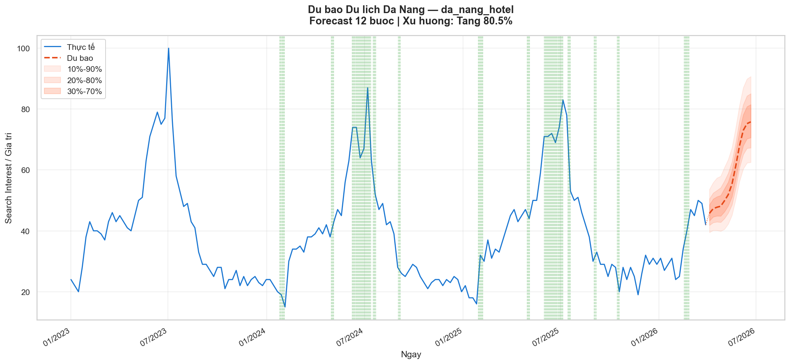
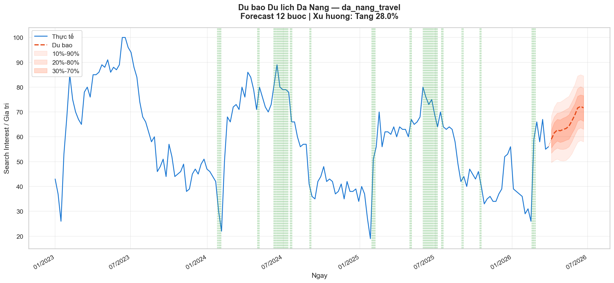
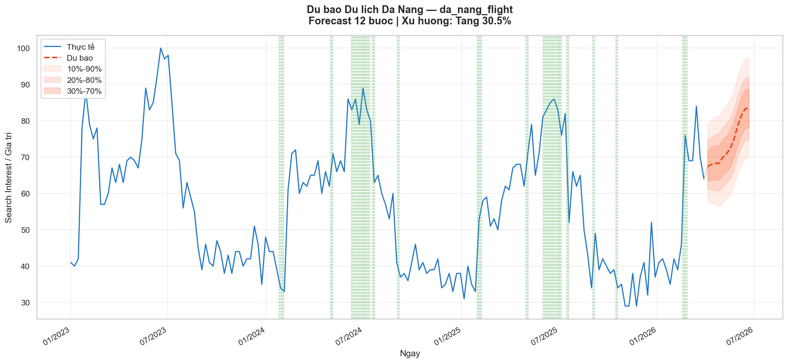
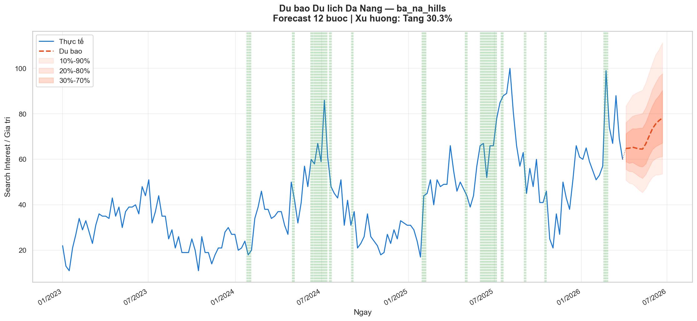
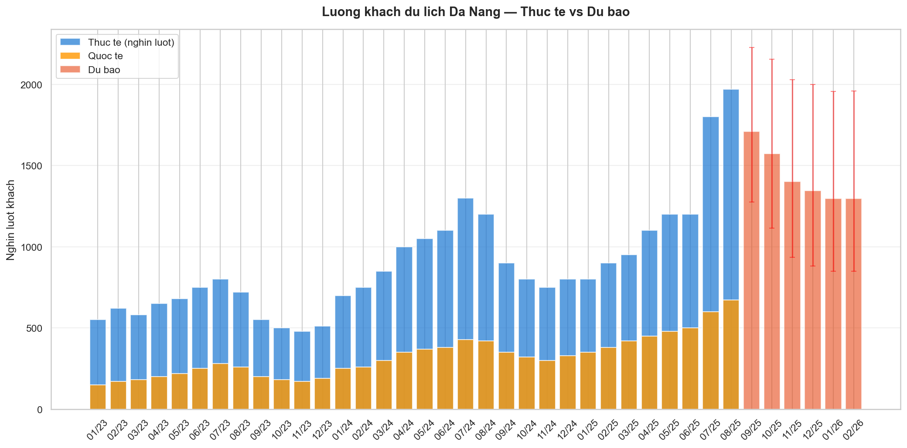
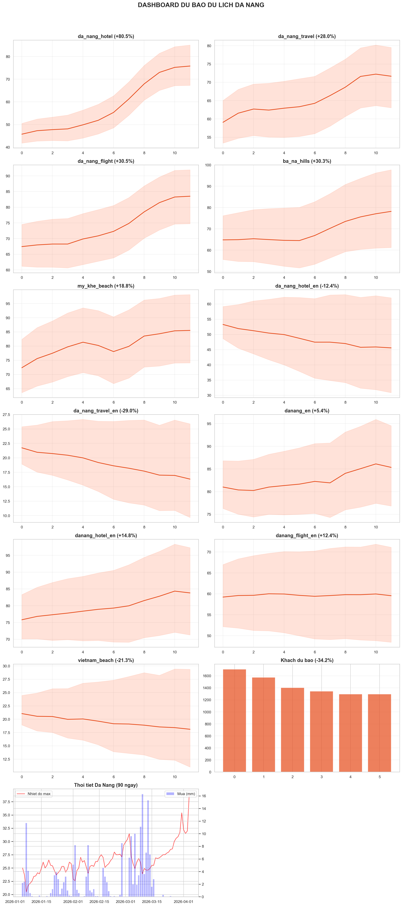

# 🏖️ Da Nang Tourism Forecast

Dự báo du lịch Đà Nẵng sử dụng **Google TimesFM 2.5** — foundation model cho time series forecasting (200M params, ICML 2024).

Kết hợp nhiều nguồn dữ liệu miễn phí để dự đoán lượng khách, xu hướng tìm kiếm, và đưa ra khuyến nghị cho ngành du lịch.

## 📈 Kết quả mẫu

### Google Trends — "khách sạn đà nẵng" (+80.5%)



### Google Trends — "du lịch đà nẵng" (+28.0%)



### Google Trends — "vé máy bay đà nẵng" (+30.5%)



### Google Trends — "bà nà hills" (+30.3%)



### 👥 Lượng khách du lịch — Thực tế & Dự báo



### 📊 Dashboard tổng hợp



## 🎯 Tính năng

- **Google Trends Forecast** — Dự báo 11 search queries (VN + EN) liên quan đến du lịch Đà Nẵng
- **Monthly Visitors Forecast** — Dự báo lượng khách lưu trú hàng tháng
- **Weather Integration** — Tích hợp thời tiết Đà Nẵng từ Open-Meteo
- **Event Calendar** — Lịch sự kiện lớn (DIFF, Tết, 30/4, Quốc khánh...)
- **Auto Dashboard** — Tự generate charts + CSV + nhận định xu hướng
- **Jupyter Notebook** — Interactive notebook để explore data & forecast

## 📊 Data Sources

| Nguồn | Loại | Tần suất | Chi phí |
|---|---|---|---|
| Google Trends | Search interest | Daily/Weekly | Miễn phí |
| Open-Meteo | Thời tiết Đà Nẵng | Daily | Miễn phí |
| Cục Thống kê ĐN | Lượng khách | Monthly | Miễn phí (báo chí) |
| Event Calendar | Sự kiện lớn | Manual | Miễn phí |

## 🚀 Quick Start

```bash
# Clone
git clone https://github.com/phanngoc/danang-tourism-forecast.git
cd danang-tourism-forecast

# Setup
python3 -m venv .venv
source .venv/bin/activate
pip install -r requirements.txt

# Cài TimesFM từ source (recommended)
pip install timesfm[torch]

# Chạy pipeline
python run.py                    # Full pipeline (có Google Trends)
python run.py --no-trends        # Offline (không cần Google Trends API)
python run.py --trends-horizon 24 --visitor-horizon 12  # Custom

# Hoặc chạy notebook
jupyter notebook notebook.ipynb
```

## 📓 Jupyter Notebook

File `notebook.ipynb` chứa interactive analysis đầy đủ:

1. 🌡️ Thời tiết Đà Nẵng (nhiệt độ + mưa)
2. 🔍 Google Trends — 11 queries VN + EN
3. 👥 Lượng khách hàng tháng (stacked bar)
4. 📈 Forecast Trends — 11 charts dự báo
5. 📊 Forecast Visitors — dự báo 6 tháng
6. 🔗 Correlation heatmap giữa các queries
7. 📅 Seasonality analysis (mùa vụ + mưa vs khách)
8. 💡 Nhận định & Khuyến nghị

## 🏗️ Kiến trúc

```
Google Trends (daily/weekly) ─┐
Open-Meteo Weather ───────────┤──> TimesFM 2.5 ──> Forecast + Quantiles
Event Calendar ───────────────┤     (200M params)        │
Cục Thống kê (monthly) ──────┘                     Dashboard / CSV
```

### Cấu trúc project

```
danang-tourism-forecast/
├── run.py                  # Entry point
├── notebook.ipynb          # Interactive Jupyter notebook
├── requirements.txt
├── src/
│   ├── data_collector.py   # Thu thập data (Trends, Weather, Events)
│   ├── forecaster.py       # TimesFM 2.5 wrapper
│   ├── visualizer.py       # Charts (matplotlib + seaborn)
│   └── pipeline.py         # End-to-end pipeline
├── docs/images/            # Charts cho README
├── data/cache/             # Cached data
└── output/                 # Generated charts + CSV
```

## 🔧 Tại sao TimesFM phù hợp?

TimesFM được pretrain trên **300B+ timepoints** từ Google Trends và Wikipedia pageviews — chính xác là loại data chúng ta đang forecast:

- **Seasonal patterns**: Bắt rất tốt pattern mùa hè (T6-T8) vs mùa mưa (T10-T12)
- **Zero-shot**: Không cần train lại, chạy ngay trên data mới
- **Quantile forecast**: Confidence intervals 10%-90% cho đánh giá rủi ro
- **Nhanh**: ~2 giây cho 11 queries trên MacBook Air M1

## 📋 Use Cases

1. **Chủ khách sạn/homestay**: Dự đoán occupancy → điều chỉnh giá phòng
2. **Nhà hàng/F&B**: Dự đoán lượng khách → quản lý tồn kho, nhân sự
3. **Sở Du lịch**: Dashboard monitoring → kế hoạch kích cầu
4. **Tour operator**: Dự báo demand → lên tour trước mùa cao điểm
5. **Investor**: Đánh giá xu hướng bất động sản nghỉ dưỡng

## ⚠️ Lưu ý

- Đây là công cụ nghiên cứu, dự báo mang tính tham khảo
- Google Trends data có thể bị rate limit nếu query quá nhiều
- Số liệu khách hàng tháng được tổng hợp từ báo chí, có thể có sai số
- Nên kết hợp với phân tích định tính (sự kiện, chính sách, thời tiết bất thường)

## 🛠️ Tech Stack

- **[TimesFM 2.5](https://github.com/google-research/timesfm)** — Google Research foundation model
- **[pytrends](https://github.com/GeneralMills/pytrends)** — Google Trends API
- **[Open-Meteo](https://open-meteo.com/)** — Weather API
- **matplotlib + seaborn** — Visualization
- **pandas + numpy** — Data processing

## 📄 License

MIT

## 🙏 Credits

- Google Research — TimesFM model
- Cục Thống kê Đà Nẵng — Monthly visitor data
- Sở Du lịch Đà Nẵng — Event calendar
